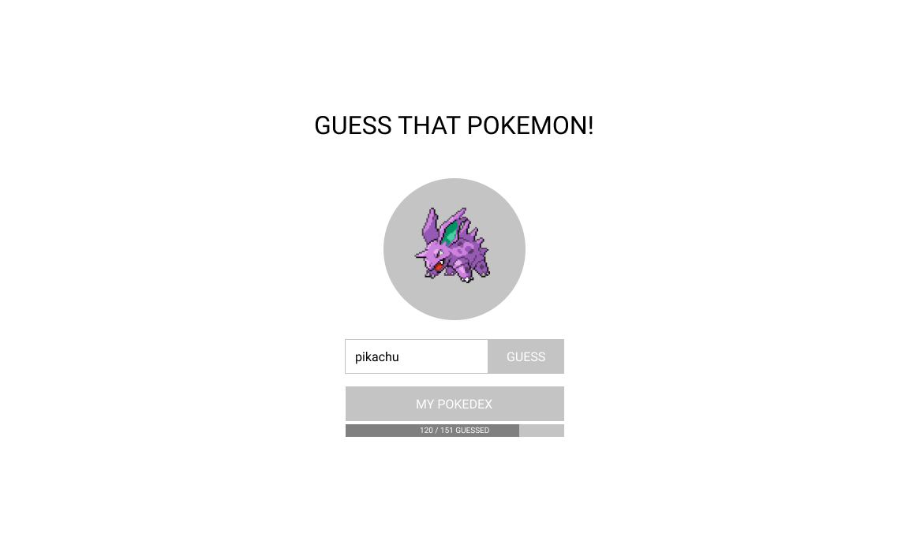
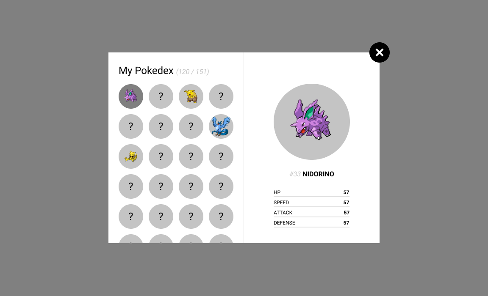

# Frontend Challenge / Guess That Pokemon!

In this challenge you will create a Pokemon-themed guessing game.

The core functionality of this challenge relies heavily on [PokeAPI](https://pokeapi.co/), so kudos to the fine folks who maintain it!

---

## The challenge

The challenge consists of two main parts - the "Guess that pokemon!" game and the pokedex. Together, they feature some of the most common technical challenges of both web application development and web development in general (handling API calls, data manipulation, state synchronisation, responsive design), but on a smaller scale.

### Guess that pokemon!

The guessing game consists of a random pokemon image, the guess submission form, the pokedex button, and a progress bar displaying the number of guessed pokemon to total pokemon in the game.

At the start of each round a random pokemon is fetched with an API call (provided for free by [PokeAPI](https://pokeapi.co/)). The pokemon's sprite (image) is displayed to the user and the user is prompted to guess the pokemon's name. A correct guess stores the pokemon to the user's pokedex, and an incorrect guess starts the game again by fetching a new random pokemon.

The game should follow these rules:

- Only 1st generation pokemon must be used in the game (the first 151 pokemon)
- Pokemon stored in the pokedex must not appear in the guessing game again (if the user guessed the pokemon correctly, that same pokemon won't appear in the game again)
- Every time a pokemon is guessed correctly the pokedex' progress bar is updated

### Pokedex

At any point during the game the user can open his or her pokedex in a popup. The pokedex contains a list of all pokemon in the game. 

Pokemon the user has guessed are displayed with their sprite. Pokemon the user hasn't guessed are displayed with a question mark.

The list of pokemon is ordered by their ID.

The number of guessed pokemon is displayed along with the total number of pokemon in the game.

By clicking on a known (guessed) pokemon in the list the pokemon's details are shown. The detail view of the pokemon displays the pokemon's sprite, name, ID, and four stats: HP, speed, attack, defense.

## First steps

- Clone or fork this repository
- Checkout the `pokedex` branch
- Get ready to get your hands dirty :)

## Rules and requirements

The images (we  call it *programmer art*) provided here are only for reference. They are intended to help you visualise the challenge. You are given full creative freedom to design the UI as you see fit, but keep in mind that your solution should be responsive.

You may use the tools you know best to solve this challenge, but we would love to see the following:

- the use of a frontend framework (preferably [React](https://reactjs.org/) or [Vue](https://vuejs.org/))
- the use of CSS preprocessors (preferably [SCSS](https://sass-lang.com/documentation/syntax)) and postprocessors or CSS-in-JS solutions
- the use of latest ECMAScript standard features
- a feeling for UX and microinteractions

For imaginary bonus points you can:

- write a custom [Webpack](https://webpack.js.org/) (or similar) configuration instead of relying on a starter kit
- write basic tests
- use [TypeScript](https://www.typescriptlang.org/) (or a static type checker such as [Flow](https://flow.org/))
- use [Storybook](https://storybook.js.org/) for any custom UI components

Don't stress for time and rush to finish, we value quality over quantity. A solution that does one thing and does it well is better than a solution that tried to do everything but simply _doesn't work_ in the end.

**Before submitting your solution**, make sure to update this document with steps on how to set up and run it!

## When you're done

- Commit changes and push them to your repository
- Shoot an email to your recruiter / interviewer with a link to your repository to let us know you're done
- Wait patiently :)

## Contact

Need to get in touch?

- ReRoot general ([:email: web@reroot.hr](mailto:web@reroot.hr)) - for questions about anything and everything

## Resources

- [ReRoot Academy / Learn Frontend Development](https://github.com/rerootagency/academy/blob/master/learn-frontend-development.md)
- [PokeAPI](https://pokeapi.co/)
- [PokeAPI Documentation](https://pokeapi.co/docs/v2.html) 
- [List of Pokemon by Kanto Pokedex number (Bulbapedia)](https://bulbapedia.bulbagarden.net/wiki/List_of_Pok%C3%A9mon_by_Kanto_Pok%C3%A9dex_number)
- [Generation I (Bulbapedia)](https://bulbapedia.bulbagarden.net/wiki/Generation_I)

## Legal

Pokémon and Pokémon character names are trademarks of Nintendo.
